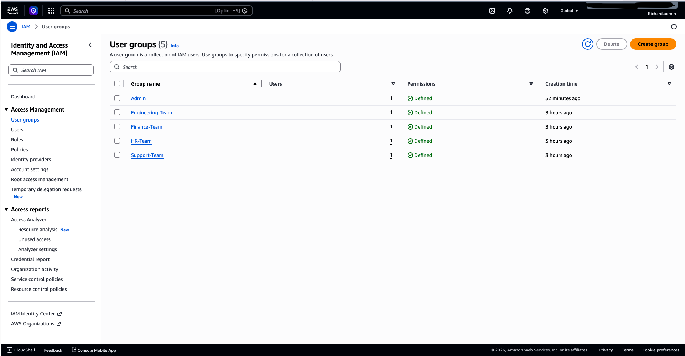
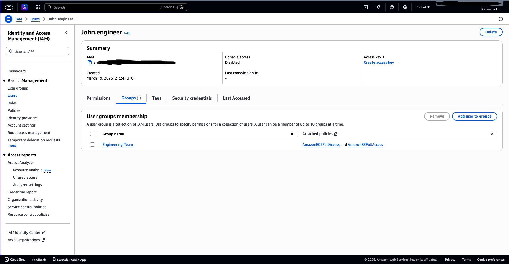
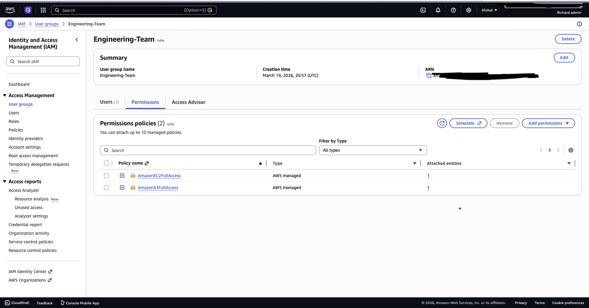
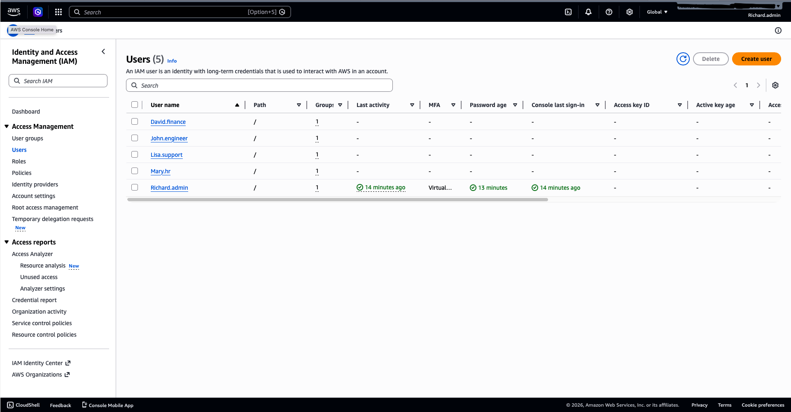
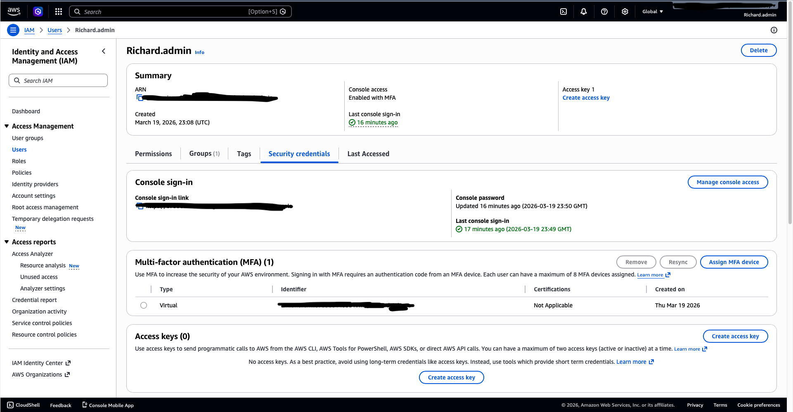
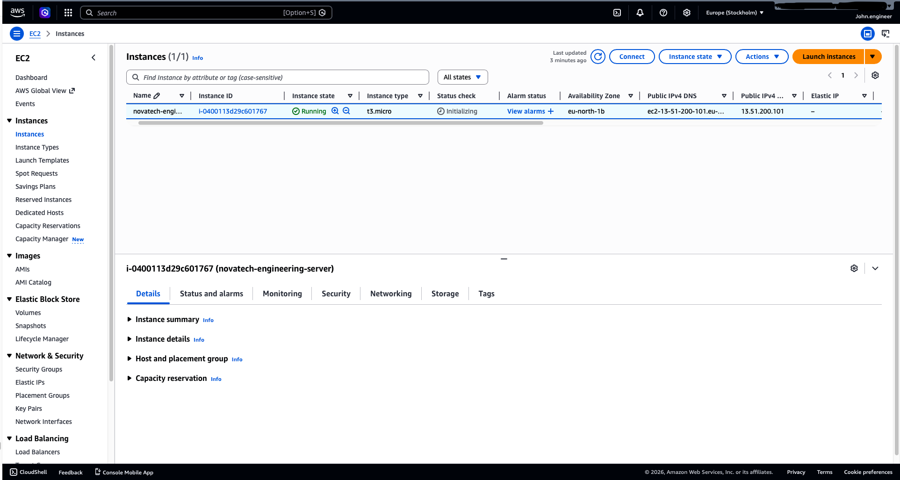

# 🏢 NovaTech IAM Architecture (AWS)

## 📌 Project Overview
This project simulates the design and implementation of an AWS Identity and Access Management (IAM) architecture for a mid-sized organization (50–100 employees).

The goal is to demonstrate how to securely manage users, groups, and permissions using industry best practices such as Role-Based Access Control (RBAC), least privilege, and multi-factor authentication (MFA).

---

## 🧱 Architecture Design

The organization is divided into departments, each with specific access needs:

- Engineering Team → EC2 & S3 access  
- HR Team → Limited access  
- Finance Team → Billing access  
- Support Team → Read-only access  

---

## 👥 IAM Users (Simulated)

The following users were created to represent employees:

- `richard.admin` (Administrator)
- `john.engineer`
- `mary.hr`
- `david.finance`
- `lisa.support`

---

## 🏗️ IAM Groups

Users are organized into groups to simplify permission management:

- Engineering-Team  
- HR-Team  
- Finance-Team  
- Support-Team  

### 📸 IAM Groups Overview
The images below shows the IAM groups created for different departments:

---

## 🔐 Access Control (RBAC)

Each user is assigned to a group based on their role.  
This ensures permissions are managed efficiently and consistently.

### 📸 User Group Assignment (john.engineer)
Example of a user assigned to the Engineering team:

---

## ⚙️ Permissions & Policies

Permissions are assigned at the group level:

- Engineering-Team → AmazonEC2FullAccess, AmazonS3FullAccess  
- HR-Team → Limited access  
- Finance-Team → Billing access  
- Support-Team → ReadOnlyAccess  

### 📸 Engineering Team Policies
The image below shows policies attached to the Engineering group:

---

## 👥 IAM Users Overview

All users created for the simulated organization:

### 📸 IAM Users List

---

## 🔐 Security Implementation

Security best practices were applied:

- MFA enabled for admin user  
- Root account avoided for daily operations  
- Least privilege principle enforced  

### 📸 MFA Enabled
The image below confirms MFA is enabled for the admin IAM user:

---

## 💻 EC2 Deployment (Engineering Team)

To simulate real-world usage, the Engineering team was granted permission to launch and manage virtual servers using Amazon EC2.

An IAM user (`john.engineer`) successfully logged in and deployed an EC2 instance, demonstrating how access control policies enable engineers to perform their tasks securely.

### 📸 EC2 Instance Running

---

## 🧠 Key Concepts Demonstrated

- Identity and Access Management (IAM)  
- Role-Based Access Control (RBAC)  
- Least Privilege Principle  
- Multi-Factor Authentication (MFA)
- Amazon EC2 (Cloud Compute)  
- Organizational Cloud Security Design  

---

## 🚀 Outcome

This project demonstrates the ability to:

- Design a scalable IAM structure  
- Manage users and permissions securely  
- Apply real-world cloud security practices  
- Simulate enterprise-level cloud environments
- Deploy and manage cloud infrastructure 

---

## 🗣️ How I Would Explain This Project

In this project, I simulated a real-world organization by designing an IAM structure that organizes users into groups and assigns permissions based on roles. I then validated the setup by logging in as an engineer and deploying an EC2 instance, demonstrating how access control enables secure cloud operations.

---

## 📌 Notes

- This is a simulated environment built for learning and portfolio purposes  
- No sensitive data or credentials are exposed  

---
