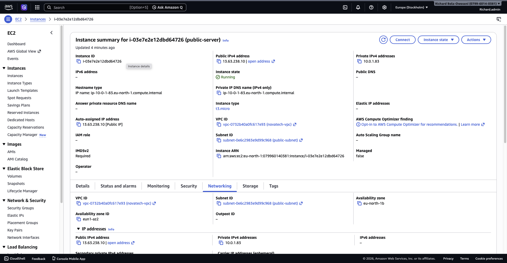
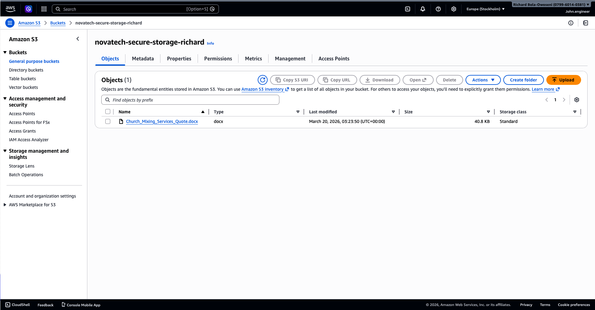
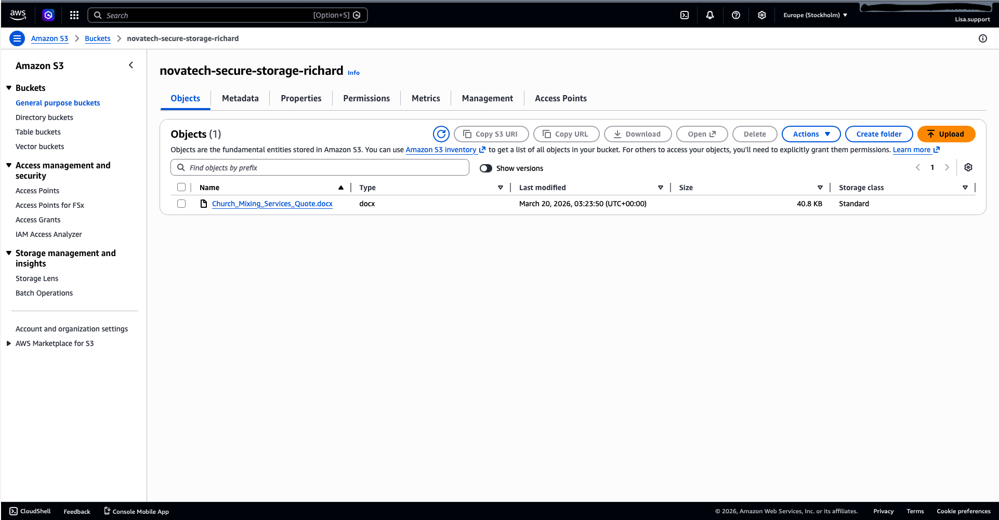

# 🏢 NovaTech IAM Architecture (AWS)

## 📌 Project Overview
This project simulates the design and implementation of an AWS Identity and Access Management (IAM) architecture for a mid-sized organization (50–100 employees).

The goal is to demonstrate how to securely manage users, groups, and permissions using industry best practices such as Role-Based Access Control (RBAC), least privilege, and multi-factor authentication (MFA).

---

## 🧱 Architecture Design

The organization is divided into departments, each with specific access needs:

- Engineering Team → EC2 & S3 access  
- HR Team → Limited access  
- Finance Team → Billing access  
- Support Team → Restricted read-only access to S3  

---

## 👥 IAM Users (Simulated)

The following users were created to represent employees:

- `richard.admin` (Administrator)
- `john.engineer`
- `mary.hr`
- `david.finance`
- `lisa.support`

---

## 🏗️ IAM Groups

Users are organized into groups to simplify permission management:

- Engineering-Team  
- HR-Team  
- Finance-Team  
- Support-Team  

### 📸 IAM Groups Overview

---

## 🔐 Access Control (RBAC)

Each user is assigned to a group based on their role.  
This ensures permissions are managed efficiently and consistently.

### 📸 User Group Assignment (john.engineer)

---

## ⚙️ Permissions & Policies

Permissions are assigned at the group level:

- Engineering-Team → AmazonEC2FullAccess, AmazonS3FullAccess  
- HR-Team → Limited access  
- Finance-Team → Billing access  
- Support-Team → Custom S3 read-only policy  

### 📸 Engineering Team Policies

---

## 👥 IAM Users Overview

### 📸 IAM Users List

---

## 🔐 Security Implementation

Security best practices were applied:

- MFA enabled for admin user  
- Root account avoided for daily operations  
- Least privilege principle enforced  
- Custom IAM policies used instead of overly broad managed policies  

### 📸 MFA Enabled

---

## 💻 EC2 Deployment (Engineering Team)

To simulate real-world usage, the Engineering team was granted permission to launch and manage virtual servers using Amazon EC2.

An IAM user (`john.engineer`) successfully deployed an EC2 instance, validating that role-based permissions were correctly configured.

### 📸 EC2 Instance Running

---

## 🌐 Public Subnet EC2 Deployment (Networking Concept)

To extend the architecture beyond IAM, a public-facing EC2 instance was deployed within a custom VPC to demonstrate AWS networking fundamentals.

This shows how cloud resources are made accessible over the internet.

---

## Implementation Details
- VPC: novatech-vpc
- Subnet: public-subnet
- Auto-assign Public IP: Enabled
- Internet Gateway: Attached to VPC
- Route Table: Configured with route to 0.0.0.0/0 via IGW

---

## 🧠 Key Validation

The EC2 instance successfully received:

- Public IPv4 address → 13.63.238.10
- Private IP address → 10.0.1.83
- Running state confirmed

This verifies that:

- The subnet is correctly configured as a public subnet
- Internet access is enabled via the Internet Gateway
- The instance is reachable externally (e.g., via SSH)

---

### 📸 Public EC2 Instance (Networking Tab) 

---

## 🧠 Concept Demonstrated
- Difference between public and private subnets
- Role of an Internet Gateway (IGW)
- How public IP addresses enable external communication
- Real-world cloud network architecture design

---

## 🪣 S3 Secure File Storage (Engineering Use Case)

A secure Amazon S3 bucket was created by the administrator and accessed by the Engineering team.

This demonstrates how infrastructure is provisioned centrally and accessed based on IAM roles.

---

## ⚙️ Implementation Steps

- S3 bucket created by `richard.admin`  
- Engineering-Team granted S3 access via IAM policy  
- `john.engineer` uploaded a file to validate access  
- Access tested across different roles  

---

## 📸 File Upload by Engineering User

---

## 👨‍💼 Support Team Read-Only Access

To enforce least privilege, a custom IAM policy was created to restrict the Support team to read-only access for a specific S3 bucket.

Unlike AWS-managed `ReadOnlyAccess`, this custom policy ensures Support users can only access required resources.

### 📸 Support User Access (Read-Only)

---

## 🔐 Access Control Validation

- Engineers can upload and manage files  
- Support can only view and download files  
- Unauthorized actions (upload/delete by support) are denied  

---

## 🧠 Real-World Scenario Simulated

- Admin provisions infrastructure (IAM, S3, EC2)  
- Engineers deploy and interact with cloud resources  
- Support teams access only necessary data  
- Access is enforced using IAM policies (no shared credentials)  

---

## 🧠 Key Concepts Demonstrated

- Identity and Access Management (IAM)  
- Role-Based Access Control (RBAC)  
- Least Privilege Principle  
- Multi-Factor Authentication (MFA)  
- Amazon EC2 (Compute)  
- Amazon S3 (Storage)  
- IAM Policy Customization  
- Secure Cloud Architecture Design  

---

## 🚀 Outcome

This project demonstrates the ability to:

- Design scalable IAM architectures  
- Implement secure access control strategies  
- Apply least privilege using custom policies  
- Deploy and manage cloud infrastructure  
- Simulate real-world enterprise environments  

---

## 🗣️ How I Would Explain This Project

In this project, I designed a secure IAM architecture for a simulated organization by grouping users based on roles and assigning permissions accordingly.

I validated the setup by:
- Deploying an EC2 instance as an engineer  
- Uploading files to S3  
- Restricting support users to read-only access using a custom policy  

This demonstrates how role-based access control and least privilege are applied in real-world cloud environments.

---

## 📌 Notes

- This is a simulated environment built for learning and portfolio purposes  
- No sensitive data or credentials are exposed  

---
